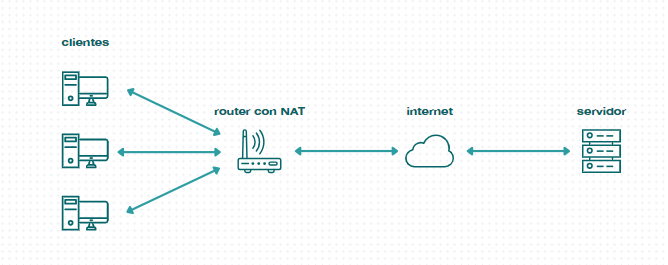
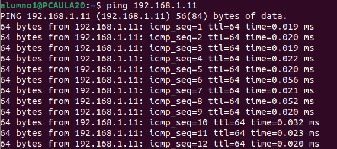

# Conexión de Sistemas en Red
  
_Larissa Gerpe Rangel y Santiago Marticó Bello_

***
  
### ÍNDICE:
1. Creación de una red LAN utilizando máquinas virtuales:
1.1 Investiga y aporta un esquema que ejemplifique su funcionamiento:   
1.2 Establecer una red de área local (LAN) en la que se conecten dos máquinas virtuales:   
1.3 Conclusión:
2. Establecimiento de permisos locales en Windows 11 Pro  
2.1 Mapa lógico de red 
2.2 Listado de dispositivos  
2.3 Presupuesto    
3. Bibliografia  
  
***

## 1. Creación de una red LAN utilizando máquinas virtuales:  

### 1.1 Investiga y aporta un esquema que ejemplifique su funcionamiento:   

● NAT: Una red de ordenadores con ip privada se conectan a internet mediante una ip IPv4 pública otorgada por el router. El objetivo de este método es “ahorrar” ips al conectar varios dispositivos a internet mediante la misma ip pública.

● Adaptador puente: Es una funcionalidad que nos ofrecen las máquinas virtuales, con ello podemos conectar una máquina virtual a la misma red que la máquina anfitrión.

● Red interna: Con esta configuración podemos hacer que varias máquinas virtuales se conecten entre ellas a pesar de que será una red aislada y no tendrá conexión a internet, solo habrá comunicación entre las máquinas virtuales

● Red NAT: Se podría decir que es la mezcla de una red interna y una NAT. Funciona igual que una NAT solo que también acepta varias máquinas virtuales gracias a que el router no solo entiende de direcciones ip, si no que también de números de puertos a la dirección ip. Permite que múltiples conexiones de diferentes dispositivos sean manejadas simultáneamente utilizando la misma IP pública.

### 1.2 Establecer una red de área local (LAN) en la que se conecten dos máquinas virtuales:

- En ambas máquinas buscamos su tipo de red desde el panel de configuración de red de virtual vox (en ambas es LAN) y lo cambiamos a red interna.

- Desde la terminal de linux de la primera máquina le configuramos una ip estática mediante un archivo “netplan”. Tendremos que crearlo, insertar la instrucción para crear la ip estática y ejecutarlo.

- Hacemos lo mismo en la segunda máquina virtual pero dándole otra ip distinta

- Para comprobar que están en la misma red LAN podemos hacer varias cosas como pedir información de una máquina desde la otra, en este caso pediremos el ping de la segunda máquina desde la primera.

### 1.3 Conclusión:

- Estas dos máquinas pueden comunicarse porque están en la misma red interna. El hipervisor, en esta caso Virtual Vox simula un switch de red para interconectar las máquinas, el tema es que este “switch” necesita unas ip privadas en un rango concreto y las máquinas de primeras no lo tienen, es por eso que le insertamos una nueva ip estática a cada una que entra dentro de ese rango (192.168.x.x). Como resultado tenemos que las máquinas virtuales comparten un trozo de red aislado, lo que les imposibilita acceder a redes externas en primera instancia.

## 2. Diseño de una red LAN:  

### 2.1 Mapa lógico de red

- A continuación muestro un mapa lógico de red, en el que interconecto 30 PCs de escritorio y 10 dispositivos inalámbricos en una pequeña oficina de una PYME, de 7,1m*7,1m. La oficina ocupa una superficie completamente diáfana de 50 m^2, por lo que solo incorporará el router instalado por el proveedor. Esta oficina también está equipada con 15 mesas con capacidad para 2 puestos de trabajo cada una. Dada esta información decidimos separar el primer PC de cada puesto 1m de la toma de red de la pared y el segundo PC 1,5m de la misma. Además de esto, la oficina dispone de cableado de red categoría 6 canalizado a través de las paredes, con 30 tomas de red ethernet distribuidas a través de las canalizaciones. En el mapa lógico además de mostrar lo anteriormente mencionado, también especifica la dirección IP de cada ordenador y su máscara de subred, para concluir nuestro mapa decidimos hacer todas las acotaciones necesarias para saber la cantidad de cable de par trenzado que íbamos a necesitar, mi conclusión fueron unos 60m de cable para poder cubrir toda la clase y para que todo quede bien conectado. También decidí comprar a parte las clavijas de RJ45, porque salía más barato que comprar ya todo junto y preparado, como este proceso lo voy a realizar yo, tuve que comprar por tanto un crimpador.

### 2.2 Listado de dispositivos

- Switch (TP-Link TL-SG3452XP)

- Bobina de cable de par trenzado (Bobina 100m Cable Red Rígido UTP Cat. 6 10/100/1000)

- Clavijas RJ45 (Equip Conector RJ45 Cat6 100 Unidades)

- Crimpador (6COMGIGA)

### 2.3 Presupuesto

|              | Switch    | Bobina   | Clavija  | Crimpador |
|--------------|-----------|----------|----------|-----------|
| Precio S/IVA | 613,03€   | 22,03€   | 26,78€   | 16,58€    |
| Precio C/IVA | 775,99€   | 27,89€   | 33,99€   | 20,99€    |
| Total S/IVA  | 613,03€   | 22,03€   | 26,78€   | 16,58€    |
| Total C/IVA  | 775,99€   | 27,89€   | 33,99€   | 20,99€    |

## 3. Bibliografía:

- https://www.pccomponentes.com/tp-link-tl-sg3452xp-switch-administrado-48-puertos-gigabit-poe-10-100-1000-4-puertos-sfp

- https://www.pccomponentes.com/bobina-100m-cable-red-rigido-utp-cat-6-10-100-1000

- https://www.pccomponentes.com/equip-conector-rj45-cat6-100-unidades

- https://www.amazon.es/6COMGIGA-Herramienta-crimpado-crimpadora-6C-CT-02/dp/B0C7VP8WMV/ref=sr_1_3_sspa?dib=eyJ2IjoiMSJ9.fo5sUoZXxncbdWC6fySPWlsLu6KdqO8ToFKGbwrY6S5m59jEO4gZxBy4bloIMwlK3PHOqXnruJQu31sKWlREGGNjM5v8u8RifINNQAu5ElHwfEhX_QUgRrCK7kn6i9-mHtpj6T6FPnXUt2BpJZTw4Fwi1n4AvlNOnF0NP6Fpk5za3NrhOl4DfloNuTW_wHn-asvXr9fUrhAsHthFpBXQPl4a67j5VRYaXMw7xlhEPz9qevc_QttVX9muCePiJMDMLo78WuvRrXbOfwpUhebPBkW4AZ4Igf7Nb3pnplLaUBU.wwiXsIcSNxcpxLaqICz4ARIZ-ge9817gHEzkw7rHdtQ&dib_tag=se&keywords=crimpadora%2Brj45&qid=1716798608&sr=8-3-spons&sp_csd=d2lkZ2V0TmFtZT1zcF9hdGY&th=1

- https://www.xatakamovil.com/conectividad/nat-network-address-translation-que-es-y-como-funciona

- https://www.fpgenred.es/VirtualBox/modo_adaptador_puente.html

- https://www.fpgenred.es/VirtualBox/modo_red_interna.html

- https://danitic.wordpress.com/2018/10/24/diferencias-entre-nat-red-nat-adaptador-puente-internal-y-solo-anfitrion-en-virtualbox/

- https://learn.microsoft.com/es-es/virtualization/hyper-v-on-windows/user-guide/setup-nat-network 
